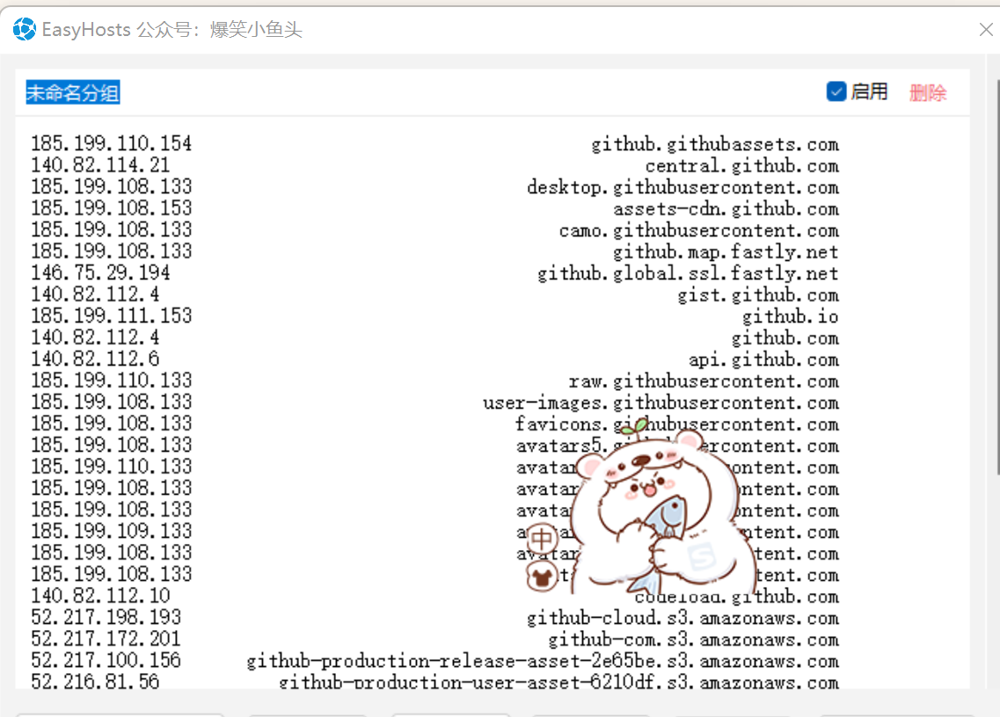
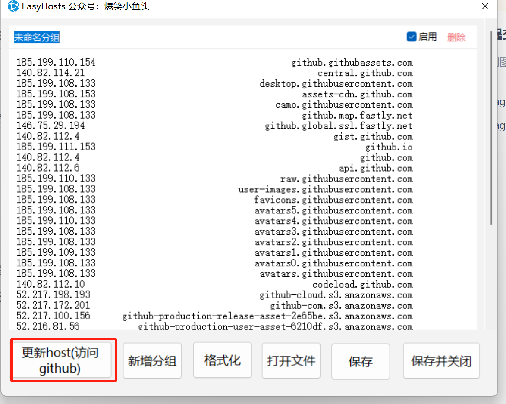

# EasyHosts

#### 介绍
快捷打开hosts文件，并进行编辑备份处理
也可手动刷新最新的github配置，方便连接github

#### 软件架构
C# winfrom

#### 安装教程

直接安装

点击更新host(访问github)按钮可以更新最快的github映射，点击后就可以正常访问github了

点击更新host(访问github)按钮可以更新最快的github映射，点击后就可以正常访问github了
